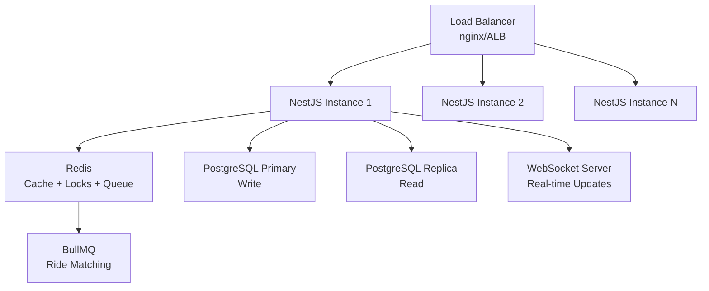

# 🛺 Dhaka Tesla Pool

> **Share a seat. Split the fare. Survive Dhaka traffic.**

A full-stack ride pooling MVP built for the RoBenDevs engineering challenge. Passengers share battery-powered "Tesla" rickshaws, split fares automatically, and track rides in real time.

🌐 **Live Demo:** https://dhaka-tesla-pool-lilac.vercel.app
🔧 **Backend API:** https://dhaka-tesla-pool-het6.onrender.com
🎬 **Demo Video:** [Link TBD]

---

## 📋 Table of Contents

- [Problem Statement](#problem-statement)
- [Features](#features)
- [Architecture](#architecture)
- [Tech Stack](#tech-stack)
- [Database Schema](#database-schema)
- [Fare Model](#fare-model)
- [Project Structure](#project-structure)
- [Prerequisites](#prerequisites)
- [Local Setup](#local-setup)
- [Docker Setup](#docker-setup)
- [Demo Credentials](#demo-credentials)
- [API Overview](#api-overview)
- [Key Decisions](#key-decisions)
- [Concurrency Handling](#concurrency-handling)
- [Testing](#testing)
- [Known Limitations](#known-limitations)
- [AI Usage](#ai-usage)
- [Deployment](#deployment)
- [Demo Video](#demo-video)

---

## 🎯 Problem Statement

Nusrat wants to get from Banani to Mohakhali. Rafiq wants to get from Banani to Gulshan 1. Jashim's "Bullet" has three seats. The app figures out — in about a second — whether these two can share a seat, split the fare fairly, and survive a ten-minute ride without any of it getting weird.

**Three actors:**
- **Passenger** (Nusrat, Rafiq, Shirin) — request rides, track status, view history
- **Driver/Tesla** (Jashim + Bullet) — accept rides, manage pools, update status
- **Pool/Ride Split** — match compatible passengers, enforce capacity, calculate individual fares

---

## 📸 Screenshots

### Login Page
.png)

### Passenger Dashboard — Request Ride
.png)

### Passenger Dashboard — My Rides
.png)

### Driver Dashboard
.png)

### Driver — Pending Rides
.png)

### Driver — My Pools
.png)

## ✅ Features Implemented

### Passenger
- Sign up / Login (JWT auth)
- Request ride with pickup area, destination, seats needed
- Auto-matched to existing pool OR creates new request
- See estimated fare before requesting
- Track ride status: REQUESTED → MATCHED → DRIVER_ARRIVED → STARTED → COMPLETED
- View ride history with driver/vehicle info
- Cancel ride (only when REQUESTED or MATCHED)

### Driver
- Sign in, go online/offline
- Register Tesla with fixed seat capacity
- See pending ride requests
- Accept a ride (creates pool automatically)
- Mark arrival, start, complete trip
- See all passengers in pool with individual fares

### Pool System
- Multiple passengers share one Tesla
- Capacity never exceeded (enforced at DB level with transactions)
- Each passenger gets individual fare
- Pool discount applied when sharing
- Compatible pickup matching (same area OR within 2km)

---

## 🏗️ Architecture

```
Browser → Next.js 14 (App Router) → NestJS API → PostgreSQL
```

feature/* branches → master → pre-release → release/v1.0.0


See [docs/ARCHITECTURE.md](docs/ARCHITECTURE.md) for full architecture diagram and ERD.

---

## 🛠️ Tech Stack

| Layer | Technology | Justification |
|---|---|---|
| Frontend | Next.js 14 (App Router) | SSR, routing, recommended in brief |
| Backend | NestJS + TypeScript | Structured modules, production-minded, easy to defend |
| Database | PostgreSQL | Relational — pooling/capacity needs FK + constraints |
| ORM | Prisma 5 | Type-safe, migration built-in, excellent DX |
| Auth | JWT + bcrypt | Stateless, no paid service needed |
| Styling | Tailwind CSS + Custom CSS | Fast, utility-first, dark theme |
| Container | Docker + docker-compose | One-command setup |
| Backend Hosting | Render (free tier) | Free, supports Node.js |
| Frontend Hosting | Vercel (free tier) | Free, perfect for Next.js |

**Why NestJS over Express?**
NestJS enforces module separation (AuthModule, RidesModule, PoolsModule etc.) which maps directly to the domain model. At interview, every architectural decision has a clear home. Express would work but requires more self-discipline to keep organized.

**Why PostgreSQL over MongoDB?**
Pool capacity enforcement requires ACID transactions — two passengers can't both claim the last seat. PostgreSQL's row-level locking and transaction support makes this safe. MongoDB would require application-level locking.

**What would make me switch?**
At 1M+ passengers, I'd add Redis for caching, read replicas for DB scaling, and consider event-driven architecture for real-time updates.

---

## 🗄️ Database Schema

| Table | Purpose |
|---|---|
| `users` | Passengers and drivers (role enum) |
| `vehicles` | Tesla/Bullet with capacity |
| `pools` | Active ride pools with available seats |
| `ride_requests` | Individual passenger requests with status |
| `pool_members` | Junction table — passenger ↔ pool with individual fare |

See [docs/ARCHITECTURE.md](docs/ARCHITECTURE.md) for full ERD.

---

## 💰 Fare Model

passengerFare = baseFare + distanceCharge - poolDiscount


| Component | Value |
|---|---|
| baseFare | 3000 paisa (৳30) |
| distanceCharge | 500 paisa/km |
| poolDiscount | 1000 paisa (৳10) if pooled |

**Example — Nusrat (Banani → Mohakhali, ~1.5km, pooled):**

fare = 3000 + (1.5 × 500) - 1000 = 2750 paisa = ৳27.50


**Why paisa (integer)?**
Floating point arithmetic causes rounding errors in financial calculations. Integer paisa avoids ৳29.999999 type bugs. Standard practice in fintech.

**Payment:** Simulated TeslaPay wallet (no real gateway).

---

## 📁 Project Structure

dhaka-tesla-pool/
├── backend/ # NestJS API
│ ├── src/
│ │ ├── auth/ # JWT auth, guards, strategy
│ │ ├── users/ # User management
│ │ ├── vehicles/ # Tesla/vehicle management
│ │ ├── rides/ # Ride requests, lifecycle
│ │ ├── pools/ # Pool matching, fare calculation
│ │ └── prisma/ # Database service
│ ├── prisma/
│ │ ├── schema.prisma # Database schema
│ │ └── seed.ts # Demo data (Jashim, Nusrat, Rafiq)
│ ├── Dockerfile
│ └── .env.example
├── frontend/ # Next.js 14
│ ├── src/
│ │ ├── app/
│ │ │ ├── login/ # Auth page
│ │ │ ├── passenger/ # Passenger dashboard
│ │ │ └── driver/ # Driver dashboard
│ │ └── lib/
│ │ └── api.ts # Axios API client
│ └── Dockerfile
├── docs/
│ └── ARCHITECTURE.md # Architecture + ERD
├── docker-compose.yml
└── README.md


---

## 📦 Prerequisites

- Node.js 20+
- Docker Desktop
- Git

---

## 🚀 Local Setup

```bash
# Clone the repo
git clone https://github.com/opu02/dhaka-tesla-pool.git
cd dhaka-tesla-pool

# Start PostgreSQL
docker-compose up -d db

# Backend setup
cd backend
cp .env.example .env
# Update DATABASE_URL in .env with your DB connection
npm install
npx prisma generate
npx prisma db push
npm run seed
npm run start:dev

# Frontend setup (new terminal)
cd frontend
npm install
npm run dev
```

Visit: http://localhost:3000

---

## 🐳 Docker Setup

```bash
# Clone the repo
git clone https://github.com/opu02/dhaka-tesla-pool.git
cd dhaka-tesla-pool

# Copy env file
cp backend/.env.example backend/.env

# Run everything
docker-compose up --build

# Seed data (in another terminal)
docker exec -it dhaka_tesla_backend npm run seed
```

Visit: http://localhost:3000

---

## 🔑 Demo Credentials

| Role | Email | Password |
|---|---|---|
| Driver | jashim@tesla.bd | jashim123 |
| Passenger | nusrat@passenger.bd | nusrat123 |
| Passenger | rafiq@passenger.bd | rafiq123 |
| Passenger | shirin@passenger.bd | shirin123 |

---

## 🔌 API Overview

| Method | Endpoint | Description |
|---|---|---|
| POST | /auth/register | Register passenger or driver |
| POST | /auth/login | Login |
| POST | /rides/request | Request a ride |
| GET | /rides/my-rides | Passenger's ride history |
| PATCH | /rides/:id/cancel | Cancel a ride |
| GET | /rides/driver/pending | Pending requests for driver |
| PATCH | /rides/:id/accept | Driver accepts ride |
| PATCH | /rides/:id/status | Update ride status |
| POST | /vehicles | Register vehicle |
| PATCH | /vehicles/toggle-online | Go online/offline |

---

## 🔧 Key Decisions & Trade-offs

**1. Prisma transactions for concurrency**
When two passengers claim the last seat simultaneously, we use `prisma.$transaction()` to lock the pool row and check availability atomically. This prevents overbooking at the application level.

**2. Pool matching rule**
Same pickup area OR within 2km radius. Simple, documentable, consistently applied to Nusrat + Rafiq's overlapping-but-not-identical trip.

**3. Status state machine**
Invalid transitions throw `BadRequestException`. You cannot go from REQUESTED directly to COMPLETED. Each step must be sequential.

**4. Individual fares per passenger**
Each `pool_member` record stores its own `fare_paisa`. Nusrat and Rafiq pay different amounts based on their individual destinations.

---

## ⚡ Concurrency Handling

**The problem:** Bullet has 1 seat left. Nusrat and Shirin both try to claim it at nearly the same instant.

**Current solution:** PostgreSQL transactions with optimistic locking. The `$transaction()` block reads available seats and updates atomically — if seats are 0, throws `BadRequestException`.

**At scale (1M passengers):**
- Add `version` column for optimistic locking
- Redis distributed lock for seat reservation
- Message queue (BullMQ) for ride matching
- Read replicas for query scaling

---

## 🧪 Testing

```bash
cd backend
npm test
```

**Tests cover:**
- ✅ Bullet's capacity can never be exceeded
- ✅ Invalid state transitions are rejected
- ✅ Nusrat and Rafiq's pooled fares calculate correctly (pool discount applied)
- ✅ Users can't modify another user's ride (ForbiddenException)
- ✅ Cancellation rules hold (can't cancel after STARTED)
- ✅ Valid lifecycle transition (MATCHED → DRIVER_ARRIVED)

---


## 🚀 Bonus — "If Oi Tesla Goes Viral"

Scaling to 1M passengers and 100k drivers:

### Load Balancing & Horizontal Scaling
- Multiple NestJS instances behind a load balancer (nginx/AWS ALB)
- Stateless JWT auth — scales horizontally without session issues
- Docker Swarm or Kubernetes for container orchestration

### Database
- PostgreSQL read replicas for read-heavy queries (ride history, status checks)
- Connection pooling with PgBouncer
- Geospatial indexes (PostGIS) for pickup area matching
- Partition ride_requests table by date for faster queries
- Index on: status, passengerId, poolId, createdAt

### Caching
- Redis for: active pool seat counts, driver online status, fare calculations
- Cache invalidation on seat booking and status changes

### Real-time Communication
- WebSocket (Socket.io) for live ride status updates
- Replace polling with push notifications

### Ride Matching at Scale
- Geospatial search with PostGIS or Elasticsearch
- Matching queue with BullMQ — async matching instead of synchronous
- Pickup zone clustering for faster compatible-route detection

### Concurrency at Scale
- Current: PostgreSQL transactions (sufficient for MVP)
- At scale: Redis distributed locks (Redlock) for seat reservation
- Optimistic locking with version column on pools table
- Idempotency keys on ride requests to prevent duplicate bookings

### Rate Limiting & Security
- Rate limiting per user (express-rate-limit / Redis)
- API Gateway for auth, rate limiting, routing
- JWT refresh tokens with rotation
- Input validation on all endpoints (class-validator)

### Observability
- Structured logging (Winston/Pino) with correlation IDs
- Metrics with Prometheus + Grafana
- Distributed tracing with OpenTelemetry
- Alerting on DB connection pool exhaustion, error rates

### Deployment Strategy
- Blue-green deployment for zero downtime
- Database migrations as separate step before deployment
- Health checks on all containers
- Auto-scaling based on CPU/memory metrics

### Queue & Events
- BullMQ for: ride matching, fare calculation, notifications
- Event sourcing for ride lifecycle (audit trail)
- Dead letter queue for failed operations




## ⚠️ Known Limitations

- No real-time updates (polling would need to be added)
- Free Render instance spins down after inactivity (50s cold start)
- No payment gateway (simulated TeslaPay)
- No map visualization (predefined areas)
- No rating system

**Next improvements:**
- WebSocket for real-time ride tracking
- Google Maps integration
- Rating system
- Push notifications
- Redis caching for fare calculations

---

## 🤖 AI Usage

**Tools used:** Claude (Anthropic), GitHub Copilot

**What AI helped with:**
- Boilerplate NestJS module generation
- Prisma schema refinement
- Test case structure
- CSS design system

**One accepted suggestion:**
Claude suggested using `prisma.$transaction()` for the concurrency problem — I accepted this as it directly maps to the brief's requirement of preventing overbooking.

**One rejected/changed suggestion:**
Claude initially suggested using Redis for the concurrency solution. I rejected this because the brief explicitly says "do not introduce Redis just to look advanced." I used PostgreSQL transactions instead, which is sufficient for MVP scale and easier to reason about.

---

## 🌐 Deployment

| Service | URL |
|---|---|
| Frontend (Vercel) | https://dhaka-tesla-pool-lilac.vercel.app |
| Backend (Render) | https://dhaka-tesla-pool-het6.onrender.com |
| Database | Render PostgreSQL (dhaka-tesla-db) |

---

## 🎬 Demo Video

[🎬 Watch Demo Video](https://www.loom.com/share/4cc046b0f76345c28c8cb4fd172173de)

---

## 📝 Assumptions

1. Pool matching: same pickup area OR within 2km is "compatible enough" for the MVP
2. Fare is calculated at request time and locked — no surge pricing
3. A driver can only have one vehicle
4. Cancellation allowed only in REQUESTED or MATCHED status
5. Geography simplified to predefined Dhaka areas with fixed coordinates
6. Free tier hosting: Render free instance may have 50s cold start delay on first request