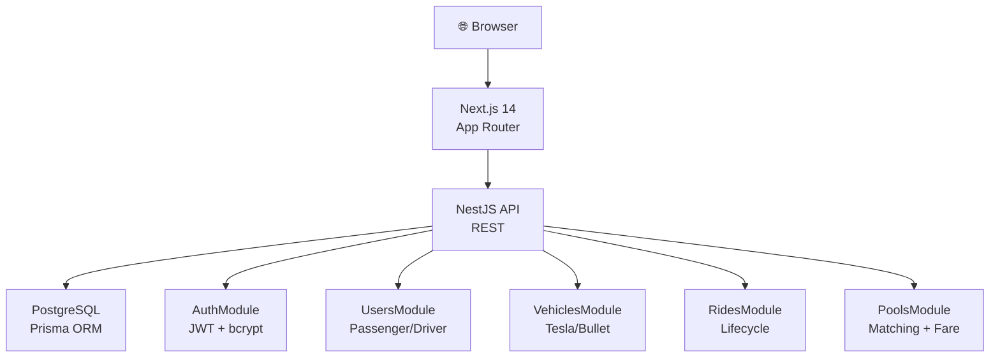
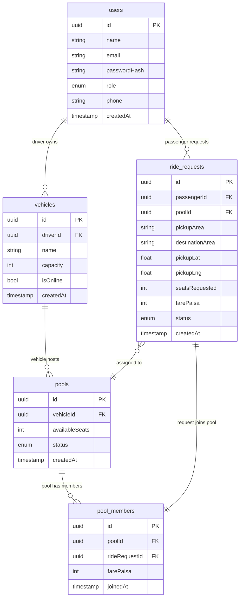

## Architecture Diagram

```mermaid
graph TD
    Browser["🌐 Browser"] --> Frontend["Next.js 14\nApp Router"]
    Frontend --> API["NestJS API\nREST"]
    API --> DB["PostgreSQL\nPrisma ORM"]
    
    API --> AuthModule["AuthModule\nJWT + bcrypt"]
    API --> UsersModule["UsersModule\nPassenger/Driver"]
    API --> VehiclesModule["VehiclesModule\nTesla/Bullet"]
    API --> RidesModule["RidesModule\nLifecycle"]
    API --> PoolsModule["PoolsModule\nMatching + Fare"]
```

## ERD Diagram

```mermaid
erDiagram
    users {
        uuid id PK
        string name
        string email
        string passwordHash
        enum role
        string phone
        timestamp createdAt
    }
    vehicles {
        uuid id PK
        uuid driverId FK
        string name
        int capacity
        bool isOnline
        timestamp createdAt
    }
    pools {
        uuid id PK
        uuid vehicleId FK
        int availableSeats
        enum status
        timestamp createdAt
    }
    ride_requests {
        uuid id PK
        uuid passengerId FK
        uuid poolId FK
        string pickupArea
        string destinationArea
        float pickupLat
        float pickupLng
        int seatsRequested
        int farePaisa
        enum status
        timestamp createdAt
    }
    pool_members {
        uuid id PK
        uuid poolId FK
        uuid rideRequestId FK
        int farePaisa
        timestamp joinedAt
    }

    users ||--o{ vehicles : "driver owns"
    users ||--o{ ride_requests : "passenger requests"
    vehicles ||--o{ pools : "vehicle hosts"
    pools ||--o{ pool_members : "pool has members"
    ride_requests ||--|| pool_members : "request joins pool"
    ride_requests }o--|| pools : "assigned to"
```